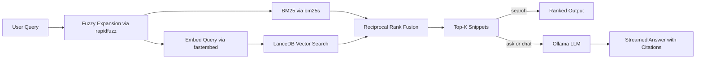

# DocuMind

**Fast, typo-tolerant, pure-local semantic + keyword search for any codebase or doc folder.**

Replaces `Cmd+F` and `grep` with a hybrid retrieval engine (BM25 + dense vectors, merged by Reciprocal Rank Fusion) that works fully offline, handles misspellings, and can synthesize grounded answers with a local Gemma 3 or Qwen2.5-Coder model via Ollama.

No VS Code extension. No cloud keys. One global CLI: `documind`.

---

## Install once, use everywhere

```bash
curl -fsSL https://raw.githubusercontent.com/Henildiyora/DocuMind/main/install.sh | bash
```

This installs `documind` as a **global command** via `pipx`. You never have to come back to this repo — `documind` works from any directory on your machine.

<details>
<summary>Prefer manual install?</summary>

```bash
# needs Python 3.10+ and pipx
pipx install "git+https://github.com/Henildiyora/DocuMind.git"
```

Or clone it and install editable:

```bash
git clone https://github.com/Henildiyora/DocuMind.git
cd DocuMind
pipx install .
```

</details>

---

## Quick start (3 commands)

```bash
# 1. One-time setup. Detects your project size and recommends the right model.
documind setup

# 2. In any project you want to search:
cd ~/code/some-other-project
documind search "ingestion pipeline"

# 3. Or ask full questions (streamed answers grounded in your code):
documind ask "where are user sessions expired?"
```

If there's no index yet, `documind search` / `documind ask` will **offer to index for you on the spot** — no separate step required.

For an interactive experience:

```bash
documind chat
```

---

## Use it from any folder

DocuMind is a global CLI after install. You don't edit or re-enter the DocuMind repo to use it:

```bash
cd ~/work/api-service     && documind index && documind search "rate limiter"
cd ~/work/ml-experiments  && documind index && documind ask  "how do we compute recall?"
cd ~/notes/research-pdfs  && documind index && documind search "attention heads"
```

Each project gets its own `.documind/` folder (git-ignored) that stores its vector + keyword index.

---

## Smart model recommender

`documind setup` scans your project and recommends a local model that fits its size. You can always override with `--tier` or `--model`.

| Tier   | Model                 | Size    | Best for                                |
|--------|-----------------------|---------|-----------------------------------------|
| tiny   | `qwen2.5-coder:1.5b`  | ~1.0 GB | Tiny projects, fastest answers          |
| small  | `gemma3:4b`           | ~3.3 GB | Balanced default for most repos         |
| medium | `qwen2.5-coder:7b`    | ~4.7 GB | Larger codebases, better reasoning      |
| large  | `qwen2.5-coder:14b`   | ~9.0 GB | Very large repos, deep explanations     |

Examples:

```bash
documind setup                      # scan + recommend interactively
documind setup --yes                # accept recommendation, auto-pull
documind setup --tier medium        # force a tier
documind setup --model gemma3:12b   # use any Ollama tag you want
```

---

## Commands

| Command                        | What it does                                                                 |
|-------------------------------|------------------------------------------------------------------------------|
| `documind setup`              | Scan project, recommend a model tier, pull via Ollama, save choice.          |
| `documind index [PATH]`       | Build or incrementally update the project index.                             |
| `documind search "query"`     | Fast ranked snippets. Typo-tolerant. No LLM needed.                          |
| `documind ask "question"`     | Retrieval + local LLM synthesis. Streams Markdown to your terminal.          |
| `documind chat`               | Interactive REPL. `/help`, `/clear`, `/k`, `/model`, `/exit`.                |
| `documind doctor`             | Check Ollama, the configured model, and index health.                        |
| `documind reset`              | Delete the project's `.documind/` directory.                                 |

Handy flags:

- `--path /some/dir` on any command to target a different project.
- `--k N` to change the number of retrieved snippets.
- `--auto-index / --no-auto-index` on `search` / `ask`.
- `--no-llm` on `ask` to skip synthesis and only print ranked hits.

---

## How it works


```mermaid
flowchart LR
    q[User Query] --> fz[Fuzzy Expansion via rapidfuzz]
    fz --> bm[BM25 via bm25s]
    fz --> ev[Embed Query via fastembed]
    ev --> vs[LanceDB Vector Search]
    bm --> rrf[Reciprocal Rank Fusion]
    vs --> rrf
    rrf --> hits[Top-K Snippets]
    hits -->|search| out1[Ranked Output]
    hits -->|ask or chat| llm[Ollama LLM]
    llm --> out2[Streamed Answer with Citations]
```

- **Hybrid retrieval.** BM25 catches exact identifiers; embeddings catch meaning. RRF merges both so either signal can save a hit.
- **Typo tolerance.** Every query term is expanded against the BM25 vocabulary via `rapidfuzz`. `documind search "ingesion"` still finds `ingestion`.
- **Incremental indexing.** Files are hashed; only changed files get re-embedded on the next `documind index`.
- **Light deps.** Embeddings use `fastembed` (ONNX runtime, no PyTorch). Vector storage uses `lancedb`. Keyword search uses `bm25s`. All pip-installable, no Docker.

### Storage layout

```
<your-project>/
  .documind/
    meta.sqlite    -- files + chunks tables (ground truth)
    lance/         -- LanceDB vector table
    bm25/          -- saved bm25s retriever
    state.json     -- schema + embedding-model info
```

---

## Supported file types

Code: Python, JS/TS, Go, Rust, Java, Kotlin, C/C++, C#, Ruby, PHP, Swift, Scala, and more.
Docs: Markdown, RST, plain text, JSON, YAML, TOML, XML, SQL, shell, `Dockerfile`, `Makefile`, `.pdf`.

Ignored by default: `.git`, `node_modules`, `venv`, `dist`, `build`, `.documind`, and friends.

---

## Configuration

DocuMind works out of the box. To tweak defaults:

```bash
documind doctor --write-config   # creates ~/.config/documind/config.toml
```

Example config:

```toml
model = "gemma3:4b"
ollama_base_url = "http://localhost:11434"
embedding_model = "BAAI/bge-small-en-v1.5"
top_k = 8
fuzzy_threshold = 82
chunk_size = 800
chunk_overlap = 120
```

`documind setup` rewrites the `model` key for you.

---

## Uninstall

```bash
pipx uninstall documind
rm -rf ~/.config/documind
```

Per-project indexes live in each project's `.documind/` directory — delete them with `documind reset` inside that project.

---

## Contributing

See [CONTRIBUTING.md](CONTRIBUTING.md) for dev setup (clone, `pip install -e ".[dev]"`, `pytest`, `ruff`).

## License

MIT — see [LICENSE](LICENSE).
