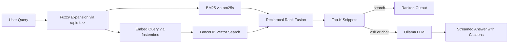

# DocuMind

**100% free, 100% local, typo-tolerant hybrid search for any codebase or doc folder.**

No API keys. No cloud. No vendor lock-in. Search and index never need any LLM at all — natural-language Q&A is an optional add-on that runs locally via Ollama.

Replaces `Cmd+F` and `grep` with a hybrid retrieval engine (BM25 + dense vectors, merged by Reciprocal Rank Fusion) that handles misspellings and can synthesize grounded answers with a small local model.

One global CLI: `documind`.

---

## Install once, use everywhere

```bash
curl -fsSL https://raw.githubusercontent.com/Henildiyora/DocuMind/main/install.sh | bash
```

That's it. `documind` is now on your PATH and works from any directory.

<details>
<summary>Prefer manual install?</summary>

```bash
# needs Python 3.10+ and pipx
pipx install "git+https://github.com/Henildiyora/DocuMind.git"
```

Or clone and install editable:

```bash
git clone https://github.com/Henildiyora/DocuMind.git
cd DocuMind
pipx install .
```

</details>

---

## Quick start — zero config, zero model

Search is ready the moment DocuMind is installed. No Ollama required.

```bash
cd ~/code/any-project
documind index                       # incremental, only re-reads changed files
documind search "auth middleware"    # fast, typo-tolerant ranked snippets
```

That's the whole happy path. Everything below is optional.

---

## Optional: natural-language Q&A

If you want `documind ask` / `documind chat`, you need a small local model. Setup is a single command that:

- Scans your project and recommends the smallest model that still works.
- Auto-starts Ollama (via `brew services` on macOS or a detached `ollama serve` otherwise) — **no second terminal needed**.
- Saves your preference and pulls the model.

```bash
documind setup           # recommends a tier, prompts to pull
documind ask "where is session expiration handled?"
documind chat            # interactive REPL
```

You'll need Ollama installed first:

- macOS: `brew install ollama`
- Linux: `curl -fsSL https://ollama.com/install.sh | sh`

---

## Use it from anywhere

```bash
cd ~/work/api-service     && documind index && documind search "rate limiter"
cd ~/work/ml-experiments  && documind index && documind ask  "how do we compute recall?"
cd ~/notes/research-pdfs  && documind index && documind search "attention heads"
```

Each project gets its own `.documind/` folder (git-ignored) with its vector + keyword index.

---

## Model tiers

DocuMind keeps this list deliberately small. All three are free, all three run locally.

| Tier   | Model                 | Size     | Best for                                       |
|--------|-----------------------|----------|------------------------------------------------|
| tiny   | `qwen2.5-coder:1.5b`  | ~1.0 GB  | Default. Fast, free, fits on any laptop        |
| small  | `gemma3:4b`           | ~3.3 GB  | Richer answers for mid-sized repos             |
| deep   | `qwen2.5-coder:7b`    | ~4.7 GB  | Deeper code reasoning on larger repos          |

Want something bigger? Pass any Ollama tag:

```bash
documind setup --model qwen2.5-coder:14b
documind setup --model llama3.1:8b
```

Other setup options:

```bash
documind setup --yes              # accept recommendation, pull interactively
documind setup --no-pull          # save preference only, skip the download
documind setup --tier small       # force a tier
```

---

## Commands

| Command                        | What it does                                                                  |
|-------------------------------|-------------------------------------------------------------------------------|
| `documind index [PATH]`       | Build or incrementally update the project index. No model needed.             |
| `documind search "query"`     | Fast ranked snippets. Typo-tolerant. No model needed.                         |
| `documind ask "question"`     | Retrieval + local LLM synthesis. Streams Markdown to your terminal.           |
| `documind chat`               | Interactive REPL. `/help`, `/clear`, `/k`, `/model`, `/exit`.                 |
| `documind setup`              | Optional. Pick + pull a local model for `ask` / `chat`.                       |
| `documind doctor`             | Check Ollama, the configured model, and index health.                         |
| `documind reset`              | Delete the project's `.documind/` directory.                                  |

Handy flags:

- `--path /some/dir` on any command to target a different project.
- `--k N` to change the number of retrieved snippets.
- `--auto-index / --no-auto-index` on `search` / `ask`.
- `--no-llm` on `ask` to skip synthesis and only print ranked hits.

---

## How it works


```mermaid
flowchart LR
    q[User Query] --> fz[Fuzzy Expansion via rapidfuzz]
    fz --> bm[BM25 via bm25s]
    fz --> ev[Embed Query via fastembed]
    ev --> vs[LanceDB Vector Search]
    bm --> rrf[Reciprocal Rank Fusion]
    vs --> rrf
    rrf --> hits[Top-K Snippets]
    hits -->|search| out1[Ranked Output]
    hits -->|ask or chat| llm[Ollama LLM]
    llm --> out2[Streamed Answer with Citations]
```

- **Hybrid retrieval.** BM25 catches exact identifiers; embeddings catch meaning. RRF merges both.
- **Typo tolerance.** Query terms are expanded against the BM25 vocabulary via `rapidfuzz`.
- **Incremental indexing.** Files are hashed; only changed files get re-embedded.
- **Light deps.** `fastembed` (ONNX, no PyTorch), `lancedb`, `bm25s`. No Docker, no GPU.
- **Ignores generated artifacts.** `htmlcov/`, `coverage.xml`, lockfiles, `*.min.js`, `*.map`, and the usual `node_modules`/`venv`/`target`/`dist` are excluded automatically.

### Storage layout

```
<your-project>/
  .documind/
    meta.sqlite    -- files + chunks tables (ground truth)
    lance/         -- LanceDB vector table
    bm25/          -- saved bm25s retriever
    state.json     -- schema + embedding-model info
```

---

## Supported file types

Code: Python, JS/TS, Go, Rust, Java, Kotlin, C/C++, C#, Ruby, PHP, Swift, Scala, and more.
Docs: Markdown, RST, plain text, JSON, YAML, TOML, XML, SQL, shell, `Dockerfile`, `Makefile`, `.pdf`.

---

## Configuration

DocuMind works out of the box. To tweak defaults:

```bash
documind doctor --write-config   # creates ~/.config/documind/config.toml
```

Example config:

```toml
model = "qwen2.5-coder:1.5b"
ollama_base_url = "http://localhost:11434"
embedding_model = "BAAI/bge-small-en-v1.5"
top_k = 8
fuzzy_threshold = 82
chunk_size = 800
chunk_overlap = 120
```

`documind setup` rewrites the `model` key for you.

---

## Uninstall

```bash
pipx uninstall documind
rm -rf ~/.config/documind
```

Per-project indexes live in each project's `.documind/` directory — delete them with `documind reset` inside that project.

---

## Contributing

See [CONTRIBUTING.md](CONTRIBUTING.md) for dev setup.

## License

MIT — see [LICENSE](LICENSE).
