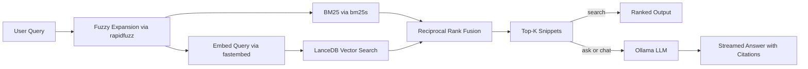

# DocuMind

**free, local, typo-tolerant hybrid search for any codebase or doc folder.**

No API keys. No cloud. No vendor lock-in. Search and index never need any LLM at all — natural-language Q&A is an optional add-on that runs locally via Ollama.

Replaces `Cmd+F` and `grep` with a hybrid retrieval engine (BM25 + dense vectors, merged by Reciprocal Rank Fusion) that handles misspellings and can synthesize grounded answers with a small local model.

One global CLI: `documind`.

---

## Install once, use everywhere

```bash
curl -fsSL https://raw.githubusercontent.com/Henildiyora/DocuMind/main/install.sh | bash
```

That's it. `documind` is now on your PATH and works from any directory.

<details>
<summary>Prefer manual install?</summary>

```bash
# needs Python 3.10+ and pipx
pipx install "git+https://github.com/Henildiyora/DocuMind.git"
```

Or clone and install editable:

```bash
git clone https://github.com/Henildiyora/DocuMind.git
cd DocuMind
pipx install .
```

</details>

---

## Quick start — zero config, zero model

Search is ready the moment DocuMind is installed. No Ollama required.

```bash
cd ~/code/any-project
documind index                       # incremental; mtime/size fast path skips re-hashing unchanged files
documind search "auth middleware"    # fast, typo-tolerant ranked snippets
```

After `documind index` finishes (in a TTY), if you have not set up a model yet, DocuMind asks:

```text
Index ready. Want AI-powered Q&A on top of this? [Y/n]
```

Say **Y** to run the same flow as `documind setup` inline. Say **n** once and you get a one-line reminder (`run documind setup anytime to enable ask/chat`); it will not ask again.

Use **`documind index --force-rehash`** if you suspect content changed without mtime/size updating (rare). **`--rebuild`** wipes `.documind/` and starts from scratch.

That's the whole happy path. Everything below is optional.

### Even better: ask questions and get a real answer

If you've run `documind setup` (see below), `documind search` upgrades itself.
Ask a question in plain English and you get a natural-language answer grounded
in your code, followed by compact file references:

```bash
documind search "what does limiter.py do in this project?"
```

Prefer the old snippet-only view? Use `--no-summary`. Want the answer plus
full code bodies? Add `--code`. Everything stays 100% local — the answer is
generated by a free Ollama model running on your machine.

---

## Optional: natural-language Q&A

If you want `documind ask` / `documind chat`, you need a small local model. Setup is a single command that:

- Detects available system RAM (and a simple GPU hint when possible)
- Filters the free/local model catalog to what fits comfortably
- Recommends the best-quality model that fits — not just the smallest
- Auto-starts Ollama (via `brew services` on macOS or a detached `ollama serve` otherwise)
- Saves your preference and pulls the model

```bash
documind models          # full catalog table
documind setup           # hardware-aware pick + optional pull
documind ask why does the rate limiter reset early   # quotes optional
documind chat            # interactive REPL with persistent threads
```

You'll need Ollama installed first:

- macOS: `brew install ollama`
- Linux: `curl -fsSL https://ollama.com/install.sh | sh`

Friendly errors (missing Ollama, daemon down, model not pulled, missing index) print 1–3 plain lines with the exact next command. Pass **`-v` / `--debug`** only when you want a full stack trace.

### keep_alive (resource efficiency)

By default DocuMind tells Ollama `keep_alive=5m` so the model unloads from RAM after a short idle period instead of staying resident forever. That lowers idle RAM, CPU, and energy use.

Override per command:

```bash
documind ask "..." --keep-alive 0      # unload immediately after each answer
documind chat --keep-alive 30m         # keep warm during a long session
documind setup --keep-alive 5m         # persist the default in config.toml
```

### Chat threads

Conversations persist per project under `.documind/chats/<name>.json`. The default thread is `default`. `documind ask` writes to `default` so you can continue later with `documind chat`.

Inside chat:

| Command | Effect |
|---------|--------|
| `/new <name>` | create and switch |
| `/switch <name>` | switch thread |
| `/threads` | list with last-message preview |
| `/rename <old> <new>` | rename |
| `/delete <name>` | delete |
| `/help` `/clear` `/k` `/model` `/exit` | as before |

Follow-ups use a windowed history (`chat_history_turns`, default 4) for retrieval and synthesis.

### Query understanding (when a model is configured)

For `ask` / `chat`, DocuMind can rewrite typos, try a few alternate phrasings, boost filename matches (e.g. "docker file" → `Dockerfile`), drop weak RRF hits, and — if still ambiguous — show an arrow-key multiple-choice clarification. Use `--no-clarify` to skip the picker. Zero-model `documind search` is unchanged.

---

## Use it from anywhere

```bash
cd ~/work/api-service     && documind index && documind search "rate limiter"
cd ~/work/ml-experiments  && documind index && documind ask how do we compute recall
cd ~/notes/research-pdfs  && documind index && documind search "attention heads"
```

Each project gets its own `.documind/` folder (git-ignored) with its vector + keyword index.

### Development workflow (stale index)

`documind search` / `documind ask` read the **last** index on disk. They do **not** auto-refresh when you save files.

- After edits, run **`documind index`** again (incremental: only changed files are re-embedded).
- After **`git checkout`**, merge, or rebase, run **`documind index`** so results match the new tree.
- Optional: keep an index hot while coding with **`documind watch`** (requires `pip install 'documind[watch]'`).
- Only **one** `documind index` / `documind watch` should run per project at a time; a lock file **`.documind-index.lock`** (next to `.documind/`, git-ignored) enforces this.

If your working tree looks newer than the last index, `search` / `ask` print a yellow hint (suppress with **`--no-stale-warn`** for scripts).

<details>
<summary>Optional git hook (post-checkout)</summary>

```bash
# ~/.git-templates or add manually to .git/hooks/post-checkout
#!/bin/sh
command -v documind >/dev/null 2>&1 && documind index || true
```

Make it executable: `chmod +x .git/hooks/post-checkout`

</details>

---

## Model catalog

Browse the full free/local set with `documind models`. Classic tiers still work for `setup --tier`:

| Tier   | Model                 | Size     | Best for                                       |
|--------|-----------------------|----------|------------------------------------------------|
| tiny   | `qwen2.5-coder:1.5b`  | ~1.0 GB  | Default. Fast, free, fits on any laptop        |
| small  | `gemma3:4b`           | ~3.3 GB  | Richer answers for mid-sized repos             |
| deep   | `qwen2.5-coder:7b`    | ~4.7 GB  | Deeper code reasoning on larger repos          |

The catalog also includes other size variants across qwen2.5-coder, gemma3, llama3.2, phi3.5, and llama3.1. `setup` filters by RAM and recommends the best quality that fits.

Want something specific? Pass any Ollama tag:

```bash
documind setup --model qwen2.5-coder:14b
documind setup --model llama3.1:8b
```

Other setup options:

```bash
documind setup --yes              # accept recommendation, pull interactively
documind setup --no-pull          # save preference only, skip the download
documind setup --tier small       # force a classic tier
documind setup --keep-alive 5m    # persist unload-after-idle default
```

---

## Commands

| Command                        | What it does                                                                  |
|-------------------------------|-------------------------------------------------------------------------------|
| `documind index [PATH]`       | Build or incrementally update the project index. No model needed.             |
| `documind watch [PATH]`       | Watch files and re-run incremental indexing after saves (`documind[watch]`).    |
| `documind search "query"`     | Ranked snippets, typo-tolerant. Adds a local-LLM answer on top if a model is ready. |
| `documind ask <question>`     | Retrieval + local LLM synthesis. Quotes optional; writes to the `default` thread. |
| `documind chat`               | Interactive REPL with persistent threads under `.documind/chats/`.            |
| `documind setup`              | Optional. Hardware-aware pick + pull a local model for `ask` / `chat`.        |
| `documind models`             | List the full free/local model catalog.                                       |
| `documind doctor`             | Check Ollama, the configured model, and index health.                         |
| `documind reset`              | Delete the project's `.documind/` directory.                                  |

Handy flags:

- `-v` / `--debug` — show full stack traces (default: friendly 1–3 line errors).
- `--path /some/dir` on any command to target a different project.
- `--k N` to change the number of retrieved snippets.
- `--keep-alive <duration>` on `ask` / `chat` / `setup` — Ollama unload timer (`0` = immediate).
- `--thread <name>` / `-t` on `chat` to start on a named thread.
- `--no-clarify` on `ask` to skip the interactive clarification picker.
- **`--auto-index` / `--no-auto-index`** (and alias **`--init-index` / `--no-init-index`**) on `search` / `ask`: **create the index only if it is missing** — they do **not** refresh an outdated index after you edit code.
- **`--stale-warn` / `--no-stale-warn`** on `search` / `ask`: warn when files on disk look newer than the last index (default: warn).
- `--summary / --no-summary` on `search` to force or skip the local-LLM answer.
- `--code / --no-code` on `search` to include full snippet bodies.
- `--no-llm` on `ask` to skip synthesis and only print ranked hits.
- **`documind index --force-rehash`** to ignore the mtime/size fast path and re-hash every file.

---

## How it works


```mermaid
flowchart LR
    q[User Query] --> fz[Fuzzy Expansion via rapidfuzz]
    fz --> bm[BM25 via bm25s]
    fz --> ev[Embed Query via fastembed]
    ev --> vs[LanceDB Vector Search]
    bm --> rrf[Reciprocal Rank Fusion]
    vs --> rrf
    rrf --> hits[Top-K Snippets]
    hits -->|search| out1[Ranked Output]
    hits -->|ask or chat| llm[Ollama LLM]
    llm --> out2[Streamed Answer with Citations]
```

- **Hybrid retrieval.** BM25 catches exact identifiers; embeddings catch meaning. RRF merges both.
- **Typo tolerance.** Query terms are expanded against the BM25 vocabulary via `rapidfuzz`.
- **Incremental indexing.** Files are hashed; only changed files get re-embedded.
- **Light deps.** `fastembed` (ONNX, no PyTorch), `lancedb`, `bm25s`.
- **Ignores generated artifacts.** `htmlcov/`, `coverage.xml`, lockfiles, `*.min.js`, `*.map`, and the usual `node_modules`/`venv`/`target`/`dist` are excluded automatically.

### Storage layout

```
<your-project>/
  .documind-index.lock   -- exclusive lock while indexing (git-ignored)
  .documind/
    meta.sqlite    -- files + chunks tables (ground truth)
    lance/         -- LanceDB vector table
    bm25/          -- saved bm25s retriever
    state.json     -- schema, embedding model, indexed_at, max_mtime_at_index
    chats/         -- persistent named chat threads (*.json)
```

---

## Supported file types

Code: Python, JS/TS, Go, Rust, Java, Kotlin, C/C++, C#, Ruby, PHP, Swift, Scala, and more.
Docs: Markdown, RST, plain text, JSON, YAML, TOML, XML, SQL, shell, `Dockerfile`, `Makefile`, `.pdf`.

---

## Configuration

DocuMind works out of the box. To tweak defaults:

```bash
documind doctor --write-config   # creates ~/.config/documind/config.toml
```

Example config:

```toml
model = "qwen2.5-coder:1.5b"
ollama_base_url = "http://localhost:11434"
keep_alive = "5m"
setup_done = true
offer_setup_after_index = true
embedding_model = "BAAI/bge-small-en-v1.5"
top_k = 8
fuzzy_threshold = 82
min_score_ratio = 0.35
chat_history_turns = 4
chunk_size = 800
chunk_overlap = 120
```

`documind setup` sets `model` and `setup_done` for you.

---

## Uninstall

```bash
pipx uninstall documind
rm -rf ~/.config/documind
```

Per-project indexes live in each project's `.documind/` directory — delete them with `documind reset` inside that project.

---

## Contributing

See [CONTRIBUTING.md](CONTRIBUTING.md) for dev setup.

## License

MIT — see [LICENSE](LICENSE).
