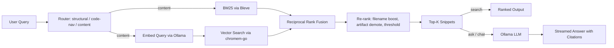

# DocuMind

**Free, local, typo-tolerant hybrid search and Q&A for any codebase or doc folder.**

No API keys. No cloud. No vendor lock-in. Search and indexing never need any LLM
at all — natural-language Q&A is an optional add-on that runs locally via
[Ollama](https://ollama.com).

This is the **Go** implementation: a single static binary (`documind`) with a
pure-Go vector store and keyword index, plus AST-aware chunking via tree-sitter.

---

## Install

One command. No Go, no compiler needed — it downloads a prebuilt binary for your
OS/CPU:

```bash
curl -fsSL https://raw.githubusercontent.com/Henildiyora/DocuMind/main/install.sh | bash
```

Then:

```bash
documind --help
```

The installer picks `macOS`/`Linux` and `amd64`/`arm64` automatically, verifies a
SHA-256 checksum, and installs to `/usr/local/bin` (or `~/.local/bin` if that
isn't writable). Options:

```bash
DOCUMIND_VERSION=v0.1.0 curl -fsSL .../install.sh | bash   # pin a version
DOCUMIND_INSTALL_DIR=~/bin curl -fsSL .../install.sh | bash # custom location
```

<details>
<summary>Build from source (contributors)</summary>

Requires Go 1.24+ and a C toolchain (tree-sitter uses cgo).

```bash
git clone https://github.com/Henildiyora/DocuMind.git
cd DocuMind
make build              # produces ./bin/documind (version-stamped via git describe)
make install            # installs to ~/.local/bin
sudo make install PREFIX=/usr/local   # or system-wide
```

</details>

---

## Quick start — zero config, zero model

Search is ready the moment you build it. **No Ollama required** for indexing or
keyword+vector retrieval.

```bash
cd ~/code/any-project
documind index                       # incremental; mtime/size fast path skips unchanged files
documind search "auth middleware"    # fast, typo-tolerant ranked snippets
```

- `documind index --rebuild` wipes `.documind/` and starts fresh (use after
  changing ignore rules or migrating from the Python build).
- `documind index --force-rehash` ignores the mtime/size fast path and re-hashes
  every file.

If Ollama isn't running, indexing completes **keyword-only** and prints a note;
re-run `documind index` later to backfill dense vectors once a model is pulled.

After a successful index (in an interactive terminal) DocuMind offers to run
`setup` once so you can enable Q&A. Say no and it won't ask again.

---

## Optional: natural-language Q&A

`documind ask` / `documind chat` synthesize grounded answers with a small local
model. Pick one with a single hardware-aware command:

```bash
documind models          # full free/local catalog (sizes, RAM, tradeoffs)
documind setup           # detects RAM/GPU, recommends the best model that fits, optionally pulls it
documind ask why does the rate limiter reset early   # quotes optional
documind chat            # interactive REPL with persistent threads
```

`setup`:

- Detects available system RAM (and a simple GPU hint when possible).
- Filters the catalog to models that fit comfortably.
- Recommends the **best-quality** model that fits — not just the smallest.
- Saves your choice to `~/.config/documind/config.toml` and can pull it.

You need Ollama installed first:

- macOS: `brew install ollama`
- Linux: `curl -fsSL https://ollama.com/install.sh | sh`

When something needed for Q&A is missing (Ollama not installed, daemon down,
model not pulled, or no index yet), DocuMind prints a short 1–3 line message with
the exact next command. Pass `-v` / `--debug` for full error detail.

### keep_alive (resource efficiency)

By default DocuMind tells Ollama `keep_alive=5m`, so the model unloads from RAM
after a short idle period instead of staying resident. Override it:

```bash
documind ask "..." --keep-alive 0      # unload immediately after the answer
documind chat --keep-alive 30m         # keep warm during a long session
documind setup --keep-alive 5m         # persist the default in config.toml
```

### Code navigation (`--file`)

Point `ask` at a file to trace where a symbol is defined and used across the
project (tree-sitter resolves the symbol, then usages are traced via the index):

```bash
documind ask --file src/server/handler.go where does the user parameter come from
documind ask --file src/main.go explain the greet function --code
```

Add `--code` to include scoped code snippets alongside the prose answer.

### Chat threads

Conversations persist per project under `.documind/chats/<name>.json`. The
default thread is `default`.

- `documind ask <question>` is one-shot and appends the turn to `default`.
- `documind chat` opens the interactive REPL.

Inside chat:

| Command | Effect |
|---------|--------|
| `/new <name>` | create and switch |
| `/switch <name>` | switch thread |
| `/threads` | list with last-message preview |
| `/rename <old> <new>` | rename |
| `/delete <name>` | delete |
| `/clear` | clear this thread's memory |
| `/k N` | set retrieval top-k |
| `/model M` | switch model for the session |
| `/help` `/exit` | help / quit |

Follow-ups use a windowed history (`chat_history_turns`, default 4) for both
retrieval and synthesis.

### Query routing

For `ask` / `chat`, DocuMind classifies each query and routes it:

- **Structural** ("what does this project do", "how many folders") → answered
  from exact, LLM-free facts (file/folder counts, languages, entry points,
  README), with a natural-language summary on top when a model is configured.
- **Code navigation** (`--file`) → symbol resolution + usage trace.
- **Content Q&A** (default) → hybrid retrieval, then synthesis.

When results are genuinely ambiguous (e.g. a basename collision) and a model is
available, DocuMind shows an arrow-key multiple-choice clarifier. Overview
questions never interrupt with one. Use `--no-clarify` to skip it.

---

## Commands

| Command                     | What it does                                                              |
|-----------------------------|--------------------------------------------------------------------------|
| `documind index [PATH]`     | Build or incrementally update the index. No model needed.                |
| `documind search <query>`   | Ranked, typo-tolerant snippets (keyword + vectors). No model needed.     |
| `documind ask [question]`   | Grounded Q&A; routes to structural / code-nav (`--file`) / content.      |
| `documind chat`             | Interactive REPL with persistent threads under `.documind/chats/`.       |
| `documind setup`            | Hardware-aware pick + optional pull of a local model for `ask`/`chat`.   |
| `documind models`           | List the full free/local model catalog.                                  |
| `documind doctor`           | Check Ollama, config, index health, and Python-era migration state.      |
| `documind reset`            | Delete the project's `.documind/` directory.                             |

Handy flags:

- `-v` / `--debug` — full error detail (default: friendly 1–3 line errors).
- `-p` / `--path <dir>` — target a different project on any command.
- `-k` / `--k N` — number of retrieved snippets (`search`, `ask`, `chat`).
- `--keep-alive <duration>` — Ollama unload timer (`ask` / `chat` / `setup`).
- `--file <path>` — code-navigation mode for `ask`.
- `--code` — include code snippets (`ask`; on by default for `search`).
- `--no-llm` — `ask` prints ranked hits only, no synthesis.
- `--no-clarify` — skip the interactive clarifier on `ask`.
- `-t` / `--thread <name>` — start `chat` on a named thread.
- `--rebuild`, `--force-rehash` — `index` control.

> Indexes are read from disk and are **not** auto-refreshed. Re-run
> `documind index` after edits, `git checkout`, merge, or rebase. Only one index
> process runs per project at a time, enforced by `.documind-index.lock`.

---

## How it works


```mermaid
flowchart LR
    q[User Query] --> rt[Router: structural / code-nav / content]
    rt -->|content| bm[BM25 via Bleve]
    rt -->|content| ev[Embed Query via Ollama]
    ev --> vs[Vector Search via chromem-go]
    bm --> rrf[Reciprocal Rank Fusion]
    vs --> rrf
    rrf --> ref[Re-rank: filename boost, artifact demote, threshold]
    ref --> hits[Top-K Snippets]
    hits -->|search| out1[Ranked Output]
    hits -->|ask / chat| llm[Ollama LLM]
    llm --> out2[Streamed Answer with Citations]
```

- **Hybrid retrieval.** BM25 catches exact identifiers; embeddings catch
  meaning. Reciprocal Rank Fusion merges both.
- **AST-aware chunking.** tree-sitter splits code by real declarations
  (functions, types, classes) for Go, Python, JS/TS, Java, C/C++, Rust, and
  more, recording a `symbol` per chunk. Unsupported files fall back to
  line/paragraph chunking.
- **Incremental indexing.** Files are hashed; only changed files are re-chunked
  and re-embedded. Embedding runs in a bounded worker pool.
- **Single-purpose LLM calls.** Classification, clarification, and synthesis are
  always separate calls — never "decide and answer" in one prompt.
- **Graceful degradation.** No Ollama → keyword-only index and snippet-only
  search still work end to end.

### Architecture

```
cmd/documind/           -- main entrypoint
internal/
  cli/                  -- cobra commands (index, search, ask, chat, setup, models, doctor, reset)
  config/               -- ~/.config/documind/config.toml load/persist
  ignorerules/          -- default + user-extended ignore dirs/files/globs
  chunker/              -- file scan, language detection, tree-sitter AST chunking
  store/                -- SQLite (modernc, pure-Go) metadata: files + chunks
  vectorstore/          -- chromem-go dense vector store (precomputed embeddings)
  kwindex/              -- Bleve keyword/BM25 index
  indexer/              -- pipeline orchestration + exclusive project lock
  ollama/               -- Ollama HTTP client (embeddings, chat, pull) + typed errors
  search/               -- hybrid retrieval, RRF, re-ranking
  structural/           -- LLM-free project facts
  router/               -- query classification + clarification
  prompts/              -- single-purpose prompt templates
  navigation/           -- symbol resolution + usage tracing for --file
  threads/              -- persistent named chat threads
  models/               -- model catalog + hardware-aware recommendation
  cliui/                -- colors, prompts, interactive pickers
```

### Storage layout

```
<your-project>/
  .documind-index.lock   -- exclusive lock while indexing (git-ignored)
  .documind/
    meta.sqlite          -- files + chunks tables (ground truth)
    chroma/              -- chromem-go vector collection
    bleve/               -- Bleve keyword index
    state.json           -- schema, embedding model/dim, indexed_at
    chats/               -- persistent named chat threads (*.json)
```

---

## Supported file types

Code: Go, Python, JS/TS, Java, C/C++, Rust, and many more via extension mapping.
tree-sitter grammars power AST chunking for Go, Python, JS/TS, Java, C/C++, and
Rust; other code and doc types (Markdown, RST, text, JSON, YAML, TOML, XML, SQL,
shell, `Dockerfile`, `Makefile`) use line/paragraph chunking.

> Note: unlike the Python build, the Go version does **not** index PDFs.

---

## Configuration

DocuMind works out of the box. The user config lives at
`~/.config/documind/config.toml` (honoring `$XDG_CONFIG_HOME`). `documind setup`
writes `model`, `setup_done`, and (optionally) `keep_alive` for you.

Example:

```toml
model = "gemma3:4b"                 # Ollama chat model tag
ollama_base_url = "http://localhost:11434"
keep_alive = "5m"
setup_done = true
offer_setup_after_index = true
embedding_model = "nomic-embed-text"   # Ollama tag (NOT a HuggingFace repo id)
embedding_dim = 768
top_k = 8
min_score_ratio = 0.35
chat_history_turns = 4
chunk_size = 800
chunk_overlap = 120
```

You can also extend (not replace) the built-in ignore rules:

```toml
extra_ignore_dirs = ["fixtures", "vendored"]
extra_ignore_files = ["NOTES.txt"]
extra_ignore_globs = ["*.snapshot"]
```

---

## Migrating from the Python build

The original Python implementation lives on the `main` branch. If you previously
indexed a project with it, the on-disk format differs (Python used LanceDB +
bm25s; Go uses chromem-go + Bleve + SQLite).

Run `documind doctor` to check migration state. It flags:

- An `embedding_model` set to a HuggingFace repo id (e.g.
  `BAAI/bge-small-en-v1.5`) — change it to an Ollama tag like `nomic-embed-text`.
- Python-era `.documind/` artifacts (LanceDB / bm25s leftovers).

To migrate, just rebuild:

```bash
documind index --rebuild
```

If you had the Python package installed:

```bash
pipx uninstall documind        # or: pip uninstall documind
rm -rf ~/.config/documind      # optional: start from Go defaults
```

Per-project indexes live in each project's `.documind/` directory — delete one
with `documind reset` inside that project.

---

## Cutting a release

Prebuilt binaries are produced by [`.github/workflows/release.yml`](.github/workflows/release.yml)
whenever a `v*` tag is pushed. It builds native cgo binaries for
macOS (arm64/amd64) and Linux (amd64/arm64) and attaches them (plus SHA-256
checksums) to the GitHub Release. The tag name is stamped into the binary
(`documind --version`).

```bash
git tag v0.1.0
git push origin v0.1.0
```

Once the workflow finishes, `install.sh` will find and install that release.

> Note: the `raw.githubusercontent.com/.../main/install.sh` URL resolves only
> after `install.sh` lands on the default branch (`main`). While testing from a
> feature branch, run `./install.sh` locally instead.

---

## License

MIT — see [LICENSE](LICENSE).
